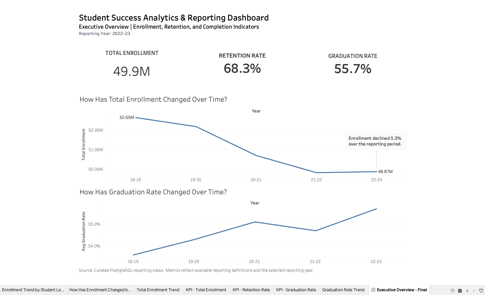
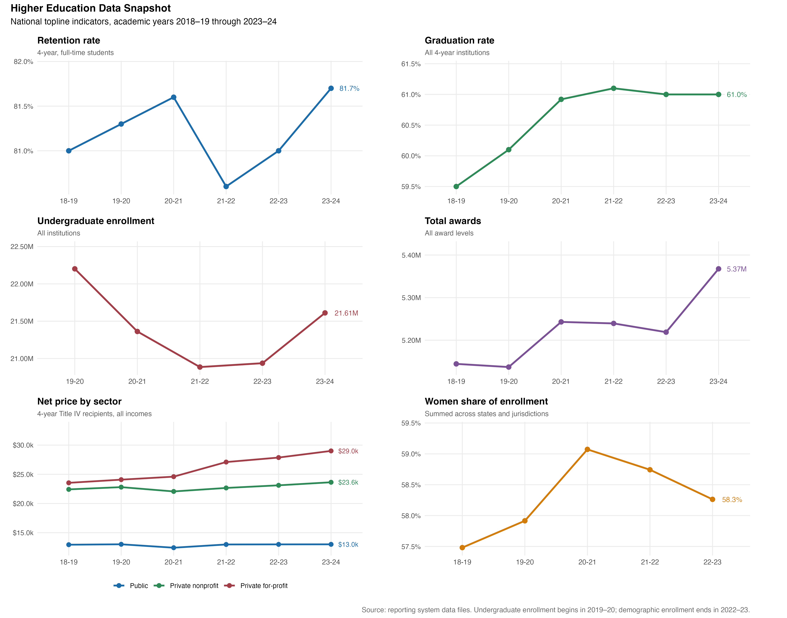
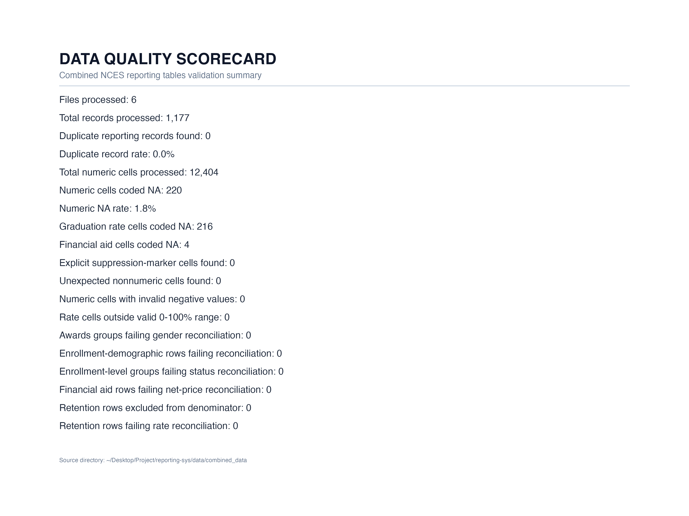
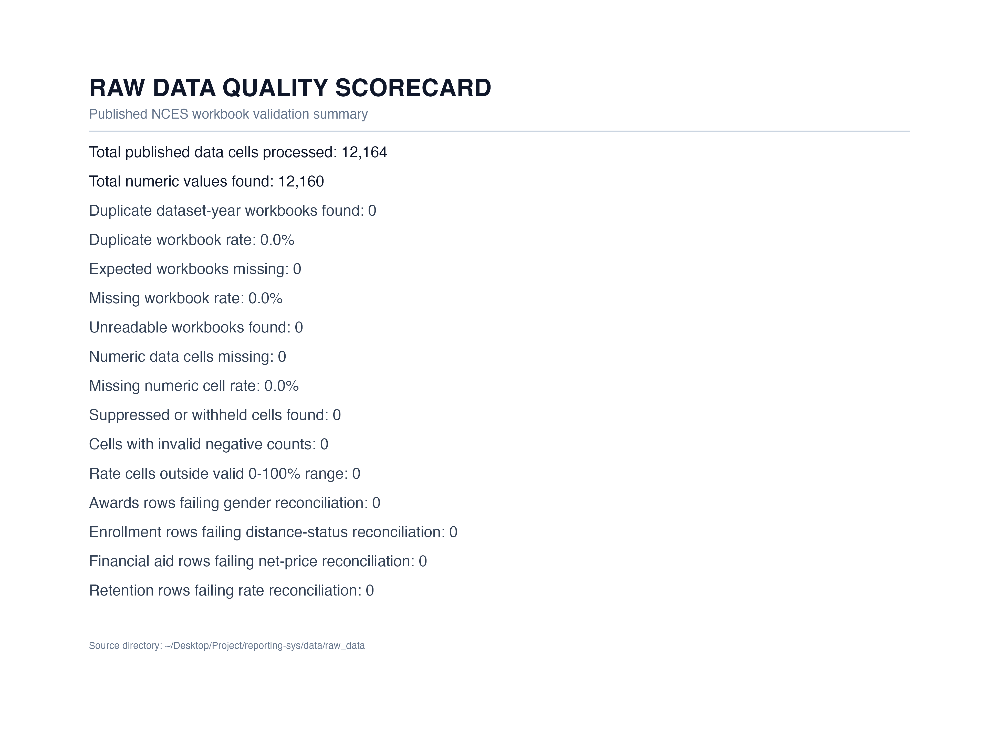
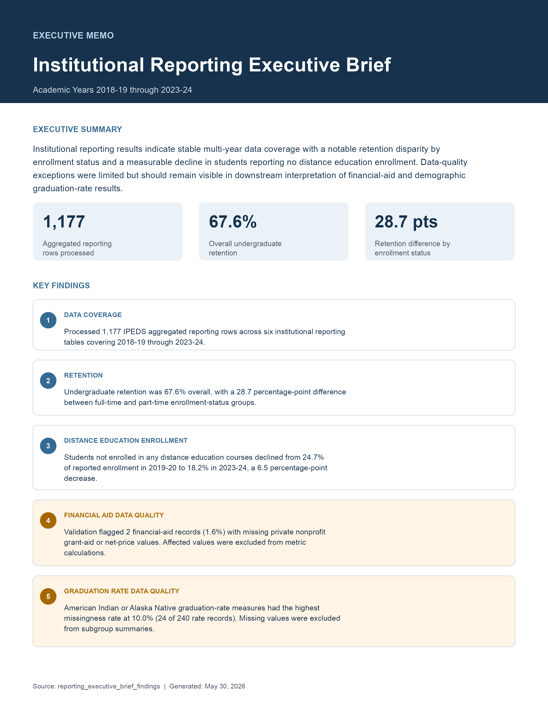

# Student Success Analytics & Reporting Pipeline

A reproducible higher-education reporting system built with **R, PostgreSQL/SQL, and Tableau** to transform public NCES/IPEDS reporting data into validated metrics, executive-facing dashboards, quality-assurance scorecards, and a stakeholder-ready reporting brief.

This project was designed to reflect institutional research and university data analyst work: combining multiple reporting tables, validating published measures, documenting data-quality limitations, creating reusable SQL reporting views, and communicating usable metrics to nontechnical decision-makers.

---

## Project Summary

University reporting teams regularly answer questions about enrollment, retention, graduation, student access, financial aid, and program outcomes. These questions require more than visualizations: analysts must organize multiple source files, validate reported values, document limitations, define metrics consistently, and deliver outputs that leaders can interpret quickly.

This project builds a repeatable reporting workflow that:

* Processes **six higher-education reporting tables**
* Covers academic years **2018–19 through 2023–24**
* Combines and validates **1,177 aggregated reporting rows**
* Evaluates **12,404 numeric cells** in combined reporting tables
* Creates reusable SQL reporting views for Tableau
* Produces an executive dashboard, two data-quality scorecards, a multi-indicator snapshot, and an executive memo

---

## Reporting Outputs at a Glance

| Deliverable                     | Purpose                                                                     |
| ------------------------------- | --------------------------------------------------------------------------- |
| Executive dashboard             | Tracks enrollment, retention, and graduation indicators for decision-makers |
| Higher education data snapshot  | Summarizes national topline trends across six reporting domains             |
| Combined data quality scorecard | Validates analysis-ready reporting tables                                   |
| Raw data quality scorecard      | Validates published source workbooks before processing                      |
| Executive memo                  | Translates findings and data limitations for nontechnical stakeholders      |
| SQL reporting views             | Supports reproducible KPI and dashboard generation                          |
| File inventory                  | Documents source-file coverage and reporting inputs                         |

---

## Executive Dashboard

The Tableau dashboard provides a high-level view of enrollment, retention, and graduation trends. It is designed as an executive overview for institutional leaders who need a fast summary of major performance indicators and multi-year change.

<!-- Replace the path below with the correct relative path to your dashboard image. -->



---

## Higher Education Data Snapshot

The reporting snapshot brings together multiple topline measures to provide a broader view of higher-education trends across the available academic years.

<!-- Replace the path below with the correct relative path to your snapshot image. -->



### Indicators Included

* Retention rate for four-year, full-time students
* Graduation rate for four-year institutions
* Undergraduate enrollment
* Total awards
* Net price by institutional sector
* Women’s share of enrollment

This output demonstrates the ability to consolidate multiple reporting domains into a concise visual summary for stakeholder review.

---

## Data Quality and Reporting Validation

A central feature of this project is the data-quality layer. Rather than presenting metrics without context, the workflow evaluates source availability, duplicates, missing values, invalid ranges, and reconciliation logic before producing reporting outputs.

### Combined Reporting Tables Quality Scorecard

The combined scorecard evaluates cleaned and reporting-ready tables after source data have been standardized and prepared for analysis.

<!-- Replace the path below with the correct relative path to your combined quality scorecard image. -->




### Raw Published Workbook Quality Scorecard

The raw-data scorecard evaluates the published source workbooks before they are combined into analysis-ready reporting tables.

<!-- Replace the path below with the correct relative path to your raw quality scorecard image. -->



---

## Executive Reporting Brief

The project includes an executive memo that converts technical reporting outputs into a concise briefing for institutional decision-makers. The memo presents headline measures, key findings, and data-quality cautions in a format designed for nontechnical review.

<!-- Replace the path below with the correct relative path to your executive memo image. -->



### Findings Presented in the Brief

* Processed **1,177 aggregated reporting rows** across six institutional reporting tables covering academic years 2018–19 through 2023–24.
* Reported **67.6% overall undergraduate retention**, with a **28.7 percentage-point difference** between full-time and part-time enrollment-status groups.
* Identified a decrease in students reporting no distance education enrollment, from **24.7% in 2019–20** to **18.2% in 2023–24**.
* Flagged **2 financial-aid records** with missing private nonprofit grant-aid or net-price values and excluded affected measures from metric calculations.
* Identified the highest graduation-rate missingness among American Indian or Alaska Native reporting measures, with **24 of 240 rate records missing**.

---

## Business Problem

Higher-education reporting offices receive recurring requests about:

* Enrollment trends
* Student retention
* Graduation and completion outcomes
* Financial aid and net price
* Distance education participation
* Demographic representation
* Reporting accuracy and data completeness

When reporting processes depend on disconnected files or manual calculations, results can be difficult to reproduce, validate, and communicate consistently.

### Solution

This project creates a reproducible reporting pipeline that:

1. Inventories public higher-education reporting workbooks.
2. Cleans and standardizes reporting tables in R.
3. Validates source completeness, missingness, allowable ranges, and reconciliation logic.
4. Loads reporting-ready data into PostgreSQL.
5. Creates reusable SQL views for KPI generation.
6. Builds a Tableau dashboard and supporting reporting visuals.
7. Produces an executive brief that documents findings and limitations.

---

## Data Sources

This project uses publicly reported higher-education data derived from **NCES/IPEDS reporting workbooks and tables**.

### Reporting Domains

| Reporting Table                           | Measures Represented                                |
| ----------------------------------------- | --------------------------------------------------- |
| Awards by demographic characteristics     | Credential and award counts by demographic group    |
| Enrollment by demographic characteristics | Student enrollment counts and demographic reporting |
| Enrollment by level/status                | Undergraduate totals and enrollment-status measures |
| Financial aid                             | Grant-aid and net-price indicators                  |
| Graduation rates                          | Completion-rate reporting measures                  |
| Undergraduate retention                   | Retention indicators by reported student group      |

The project uses **aggregated public reporting data**, not individual student records or personally identifiable information.

---

## Technology Stack

| Tool                 | Application                                                                                               |
| -------------------- | --------------------------------------------------------------------------------------------------------- |
| **R**                | File inventory, data cleaning, table combination, validation, reporting figures, and scorecard generation |
| **PostgreSQL / SQL** | Exploratory queries, reusable reporting views, and dashboard-ready KPI tables                             |
| **Tableau**          | Executive dashboard development                                                                           |
| **CSV outputs**      | File inventory and processed reporting exports                                                            |
| **PNG outputs**      | Portfolio-ready scorecards, figures, dashboard previews, and executive memo                               |

---

## Reporting Workflow

```text
Raw NCES/IPEDS Reporting Workbooks
              ↓
      File Inventory and Coverage Review
              ↓
        R Cleaning and Standardization
              ↓
      Data Quality and Validation Checks
              ↓
       Combined Reporting Tables
              ↓
       PostgreSQL Reporting Views
              ↓
 Tableau Dashboard + Reporting Figures
              ↓
 Executive Memo + Quality Scorecards
```

### Validation Checks Demonstrated

The pipeline includes checks for:

* Expected workbook availability
* Duplicate dataset-year workbooks
* Unreadable source workbooks
* Duplicate combined reporting records
* Numeric missingness and coded missing values
* Invalid negative numeric values
* Rates outside the valid 0–100% range
* Awards demographic reconciliation
* Enrollment demographic and status reconciliation
* Financial-aid net-price reconciliation
* Retention-rate reconciliation

---

## Key Results

| Reporting Metric                             |                  Result |
| -------------------------------------------- | ----------------------: |
| Reporting tables processed                   |                       6 |
| Aggregated reporting rows processed          |                   1,177 |
| Reporting years covered                      | 2018–19 through 2023–24 |
| Combined numeric cells evaluated             |                  12,404 |
| Combined numeric cells coded missing         |                     220 |
| Combined numeric missingness rate            |                    1.8% |
| Duplicate combined records identified        |                       0 |
| Invalid negative values identified           |                       0 |
| Out-of-range rate values identified          |                       0 |
| Raw published data cells evaluated           |                  12,164 |
| Missing expected raw workbooks               |                       0 |
| Unreadable raw workbooks                     |                       0 |
| Reconciliation failures in validation checks |                       0 |

---

## Skills Demonstrated

This project demonstrates experience relevant to institutional research, university analytics, and reporting analyst positions:

* Creating a reproducible reporting workflow across multiple public data sources
* Cleaning, standardizing, and combining higher-education reporting tables
* Developing SQL reporting views for dashboard-ready measures
* Designing automated data-quality and reconciliation checks
* Identifying missingness and documenting reporting limitations
* Producing stakeholder-facing dashboards and executive summaries
* Communicating technical results to nontechnical audiences
* Organizing code, data, outputs, and documentation for reproducibility

---

## Reporting Limitations

* The project uses aggregated public reporting data rather than student-level administrative records.
* Reporting availability varies by metric and academic year.
* Some missing subgroup values were retained as documented data-quality findings and excluded from affected calculations.
* The dashboard preview presents selected KPIs for an executive overview, while other reporting outputs summarize the broader available reporting window.
* Results are descriptive reporting indicators and should not be interpreted as causal findings.

---

## Portfolio Takeaway

This project is not only an analysis of higher-education data. It is a small reporting system designed to demonstrate how recurring institutional questions can be answered through:

* Structured source-data management
* Repeatable cleaning and validation
* SQL-based reporting logic
* Executive-facing dashboards
* Transparent data-quality documentation
* Clear communication of findings and limitations

The final deliverables show the full workflow from public reporting files to decision-ready metrics.

---

## License

See the repository `LICENSE` file for usage terms.
